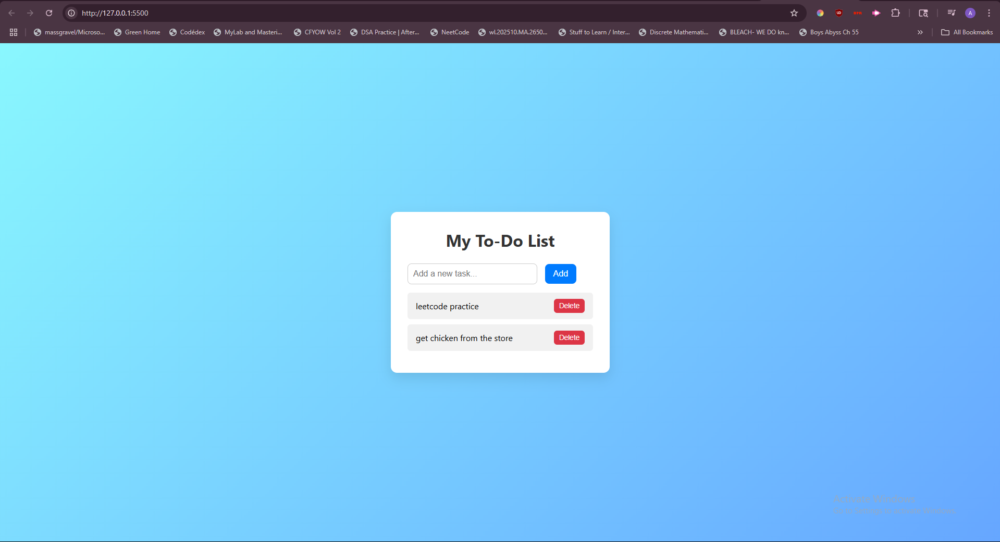

# Interactive To-Do List

A sleek and modern interactive To-Do List built with HTML, CSS, and JavaScript. Add tasks, mark them as complete, or delete them—all with a clean user experience.

## Features

- Add new tasks with a single click
- Mark tasks as **complete** by clicking on them
- Delete tasks with a built-in **delete button**
- Responsive and clean UI with hover effects and animations

## Preview

## Technologies Used

- HTML5
- CSS3 (flexbox, gradients, animations)
- JavaScript (DOM manipulation)

